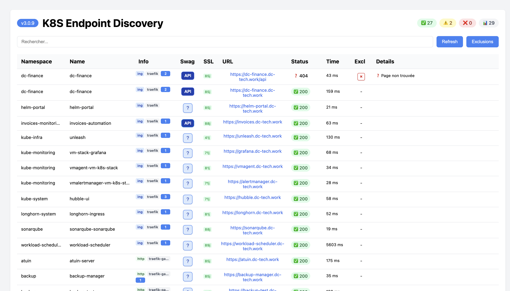
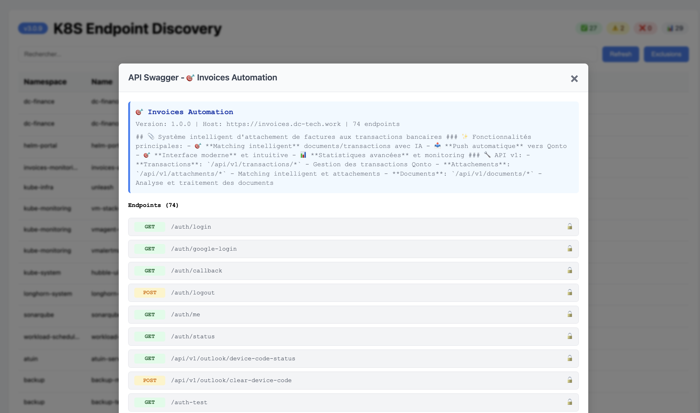

# Portal Checker

[](https://github.com/your-repo/portal-checker/releases)
[](LICENSE)
[](https://hub.docker.com/r/fizzbuzz2/portal-checker)

**Monitor your Kubernetes endpoints with a beautiful, real-time dashboard.** Portal Checker automatically discovers Ingress and HTTPRoute resources across your cluster and provides instant visibility into endpoint health.

## Dashboard



The dashboard provides a clean overview of all your Kubernetes endpoints with:

- **Namespace & Name**: Quick identification of resources
- **Info Column**: Compact badges showing type (`ing`/`http`), ingress class, and annotation count
- **Swagger Discovery**: Automatic API documentation detection with security analysis
- **SSL Monitoring**: Certificate expiration tracking with color-coded warnings
- **Status & Response Time**: Real-time health checks with latency metrics

## Swagger/OpenAPI Discovery



Automatically discovers and analyzes API documentation:

- Scans 13+ common Swagger endpoint paths
- Displays all endpoints with methods (GET, POST, PUT, DELETE)
- Shows security status for each endpoint (protected/unprotected)
- Detects PII exposure and secrets in API schemas

## Key Features

### Automatic Discovery

Scans all namespaces for **Ingress** and **HTTPRoute** resources, extracting URLs with full metadata including namespace, resource name, ingress class, and annotations.

### Real-time Health Monitoring

| Feature | Description |
| ------- | ----------- |
| **Concurrent Checks** | Parallel health checks with configurable concurrency (default: 10) |
| **Smart Caching** | Reduces API calls with configurable TTL |
| **Background Testing** | Periodic automated tests at configurable intervals |
| **Response Times** | Track latency for each endpoint |

### Interactive Dashboard

- **Search & Filter**: Quickly find endpoints by namespace, name, or URL
- **Sortable Columns**: Sort by any column including status, response time, or namespace
- **Status Overview**: Quick stats showing healthy, warning, and failed counts
- **Auto-refresh**: Configurable automatic refresh (default: 30 seconds)
- **Mobile Responsive**: Works on desktop, tablet, and mobile devices

### Smart URL Exclusions

Exclude URLs using multiple methods:

```yaml
# YAML patterns with wildcards
excludedUrls:
  - "monitoring.*"           # Exclude all monitoring subdomains
  - "*.internal/*"           # Exclude internal paths
  - "grafana.*/api/health"   # Exclude specific health endpoints
  - "*.dc-tech.work/api"     # Exclude API paths on specific domain
```

Or use Kubernetes annotations:

```yaml
metadata:
  annotations:
    portal-checker.io/exclude: "true"
```

### API Discovery (Autoswagger)

- Scans 13+ common Swagger endpoint paths
- Detects PII exposure in API schemas
- Identifies exposed secrets (API keys, JWT tokens, AWS credentials)
- Groups findings by security severity

## Quick Start

### Prerequisites

- Kubernetes cluster with RBAC enabled
- Helm 3.x
- kubectl configured for your cluster

### Installation

```bash
# Install with default settings
helm install portal-checker helm/ \
  --namespace monitoring \
  --create-namespace
```

### Access the Dashboard

```bash
# Port forward to access locally
kubectl port-forward svc/portal-checker 8080:80 -n monitoring

# Open in browser
open http://localhost:8080
```

## Configuration

### Environment Variables

| Variable | Default | Description |
| -------- | ------- | ----------- |
| `REQUEST_TIMEOUT` | `10` | HTTP request timeout in seconds |
| `MAX_CONCURRENT_REQUESTS` | `10` | Number of concurrent health checks |
| `CHECK_INTERVAL` | `30` | Interval between background checks (seconds) |
| `CACHE_TTL_SECONDS` | `300` | Cache TTL for URL test results |
| `KUBERNETES_POLL_INTERVAL` | `600` | K8s resource discovery interval |
| `LOG_LEVEL` | `INFO` | Logging level |
| `ENABLE_AUTOSWAGGER` | `true` | Enable API documentation discovery |

### Helm Values

```yaml
# values.yaml
resources:
  limits:
    cpu: 600m
    memory: 256Mi
  requests:
    cpu: 100m
    memory: 64Mi

ingress:
  enabled: true
  domainName: portal-checker.example.com
  tls:
    enabled: true

env:
  - name: CHECK_INTERVAL
    value: "60"
  - name: MAX_CONCURRENT_REQUESTS
    value: "5"
```

### URL Exclusions

Configure exclusions in `values.yaml`:

```yaml
excludedUrls:
  - "argocd.*/api/*"
  - "monitoring.*"
  - "*.internal/*"
  - "infisical.*/ss-webhook"
```

## Architecture

```text
                    ┌─────────────────────────────────────────────┐
                    │              Kubernetes Cluster             │
                    │  ┌─────────┐  ┌─────────┐  ┌─────────────┐ │
                    │  │ Ingress │  │ Ingress │  │  HTTPRoute  │ │
                    │  └────┬────┘  └────┬────┘  └──────┬──────┘ │
                    └───────┼────────────┼──────────────┼────────┘
                            │            │              │
                            └────────────┼──────────────┘
                                         │
                    ┌────────────────────▼────────────────────┐
                    │           Portal Checker                 │
                    │  ┌──────────────────────────────────┐   │
                    │  │      Resource Discovery          │   │
                    │  │   • Ingress (networking.k8s.io)  │   │
                    │  │   • HTTPRoute (gateway API)      │   │
                    │  └──────────────┬───────────────────┘   │
                    │                 │                        │
                    │  ┌──────────────▼───────────────────┐   │
                    │  │      URL Extraction & Filtering  │   │
                    │  │   • Exclusion patterns           │   │
                    │  │   • Annotation checks            │   │
                    │  └──────────────┬───────────────────┘   │
                    │                 │                        │
                    │  ┌──────────────▼───────────────────┐   │
                    │  │      Concurrent Health Checks    │   │
                    │  │   • aiohttp async client         │   │
                    │  │   • Configurable parallelism     │   │
                    │  └──────────────┬───────────────────┘   │
                    │                 │                        │
                    │  ┌──────────────▼───────────────────┐   │
                    │  │      Web Dashboard (Flask)       │   │
                    │  │   • Real-time status             │   │
                    │  │   • Search & sorting             │   │
                    │  └──────────────────────────────────┘   │
                    └─────────────────────────────────────────┘
```

### Module Structure (v3.0.0+)

```text
src/
├── main.py                    # Entry point, server configuration
├── api.py                     # Flask routes and handlers
├── config.py                  # Centralized configuration
├── kubernetes_client.py       # K8s resource discovery
├── utils.py                   # URL testing utilities
└── autoswagger_integration.py # API documentation discovery
```

## Development

### Local Development

```bash
# Install dependencies with uv
uv sync

# Run development server
task run-dev

# Or manually
FLASK_ENV=development PORT=5001 python -m src.main
```

### Task Commands

```bash
task run-dev          # Start development server
task test-coverage    # Run tests with coverage
task validate-yaml    # Validate configuration files
task build            # Build Docker image
task push             # Push to registry
task deploy-full      # Complete deployment workflow
task logs             # Stream application logs
task status           # Show pod status
task memory-check     # Check memory usage
```

### Running Tests

```bash
# Run all tests
uv run pytest tests/ -v

# Run with coverage
task test-coverage

# Run specific test
pytest tests/test_excluded_urls.py -v
```

## API Endpoints

| Endpoint | Method | Description |
| -------- | ------ | ----------- |
| `/` | GET | Main dashboard |
| `/api/test` | GET | Run health checks |
| `/api/refresh` | POST | Force URL rediscovery |
| `/api/swagger` | GET | Get Swagger discovery results |
| `/health` | GET | Application health |
| `/ready` | GET | Readiness check |
| `/memory` | GET | Memory statistics |

## Troubleshooting

### High CPU Usage

- Increase `CHECK_INTERVAL` to reduce frequency
- Reduce `MAX_CONCURRENT_REQUESTS`
- Review number of monitored URLs

### URLs Not Discovered

- Verify RBAC permissions (ClusterRole needs list/watch on Ingress and HTTPRoute)
- Check namespace permissions
- Review exclusion patterns

### Memory Issues

- Check with `task memory-check`
- Reduce cache TTL if needed
- Consider disabling Autoswagger if not needed

### SSL Certificate Errors

```yaml
env:
  - name: CUSTOM_CERT
    value: "/path/to/ca-bundle.crt"
```

## Contributing

Contributions are welcome! Please read [CONTRIBUTING.md](CONTRIBUTING.md) for guidelines.

## License

MIT License - see [LICENSE](LICENSE) for details.
