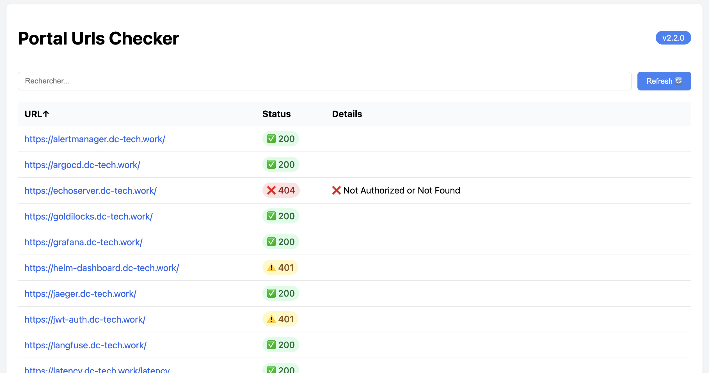

# Portal Checker

Monitor HTTP URLs by parsing ingress rules and httproute in your kubernetes cluster for availability and provide a little dashboard to show that.




## Features

- URL health monitoring
- Response code tracking
- Integration with Slack (beta)

## Installation

### Using Helm

```bash
helm install portal-checker helm \
  --namespace monitoring \
